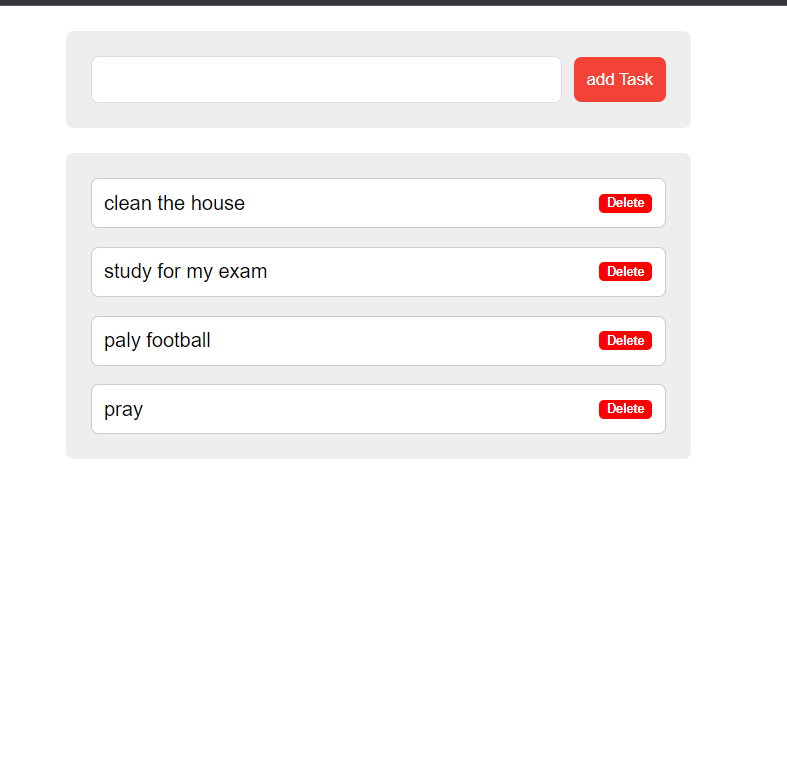

# To-Do App with Local Storage

The To-Do App with Local Storage is a web application that allows users to manage their tasks and store them locally in the browser. It provides a simple interface to add, update, and delete tasks.



## Features

- Add new tasks with a title and optional description.
- Mark tasks as completed.
- Edit existing tasks to modify their title or description.
- Delete tasks.
- Store tasks locally in the browser's localStorage for persistence across sessions.

## Technologies Used

- HTML, CSS, and JavaScript for the frontend.
- Local Storage API for storing tasks locally.
- Bootstrap for styling the user interface.

## Usage

1. Clone the repository:
   ```bash
   git clone https://github.com/adas0mahdi/To-Do-App-With-Local-Storage.git
A. Open the index.html file in a web browser.

B. Use the following functionality in the app:

To add a task, enter the task title in the input field and click the "Add Task" button.
To mark a task as completed, click the checkbox next to the task.
To edit a task, click the "Edit" button and modify the title or description.
To delete a task, click the "Delete" button.
Contributing
Contributions are welcome! If you want to contribute to this project, please follow these steps:

1. Fork the repository.
2. Create a new branch: git checkout -b feature/your-feature-name.
3. Make your changes and commit them: git commit -m 'Add some feature'.
4. Push to the branch: git push origin feature/your-feature-name.
5. Open a pull request.
6. 
License
This project is licensed under the MIT License.

Author
ADAS MAHDI ATEF 
<br>
<br>
<br>
 
. 


